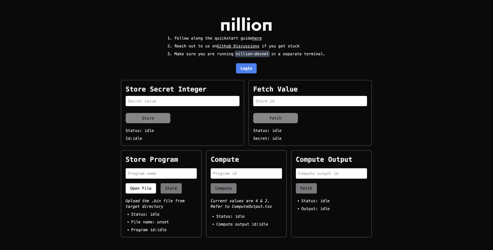

## Nextjs Example for Create Nillion App (CNA)



Welcome the Nextjs Example for CNA.

Once the CLI insturctions have finished, you can run the developent server:

```bash
npm run dev
# or
yarn dev
# or
pnpm dev
# or
bun dev
```

Open [http://localhost:3000](http://localhost:3000) with your browser to see the result.

Then follow the rest of the instructions from the Quickstart guide [here.](https://github.com/NillionNetwork/awesome-nillion/issues/2)
